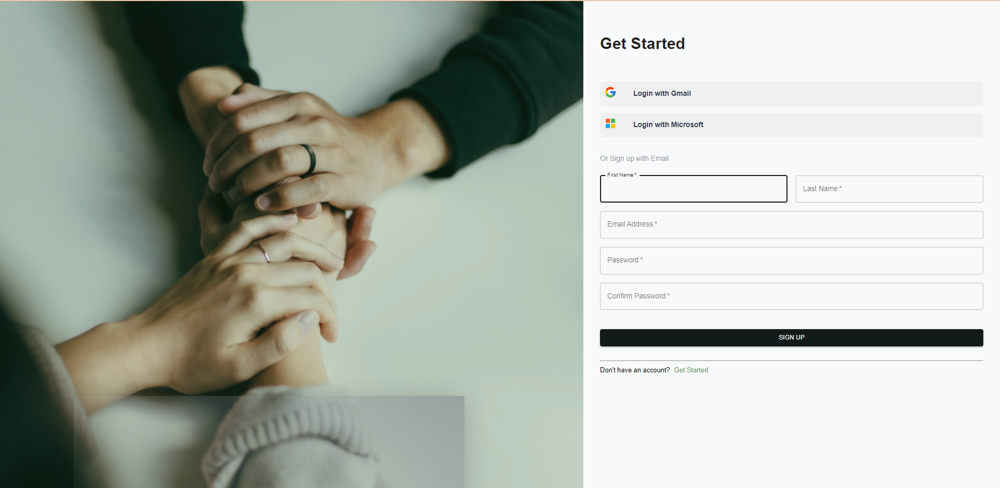
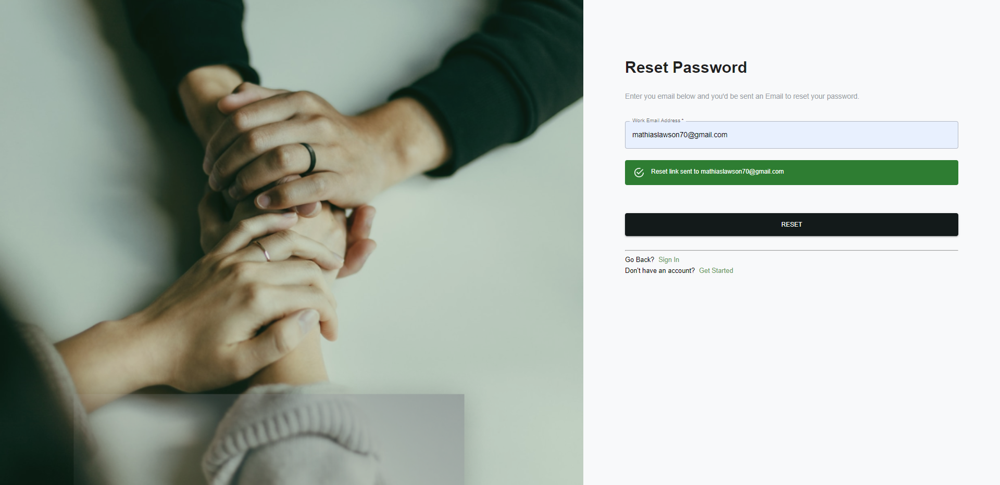

## About App
Serenitee is a web application designed to enable health personnels to track the daily progress and mental health of thier patients from the Serenitee mobile app (https://github.com/SalamiTech/Serenitte-App.git), they would be able to check on the type of music they listen to, check which health personnel is given to which patients for better accountability, proof check for the eligibility of personnels to be able to gain access to the application, track the progress of the health personnels etc. Progress for the mental health of patients would be determined based to the feedback our mobile end apps(patient & doctors end) recieves into an ML model then in total provides the steady mental progress of the patient and also the working progress of doctors and if thier methods to help thier patients really work.

## Components an features checklist
## Admin Side

# Stack & Technologies
- [x] React.
- [x] React Redux - for state management.
- [ ] Redux Saga - to manage side effects from external API calls.
- [x] Firebase Authentication (Work Email & Password).
- [x] Firestrore - store data

## Features
# Authentication
- [x] Authentication with Email & Password
- [x] Self Service with Work Email
- [ ] Google OAuth
- [ ] Engine to Validate Doctors 

# Dashboard
- [ ] Track and Represent User (Patient) data (ID, mental healt problem)
- [ ] Track and Represent (Admin/Doctors) data (Health ID, Medical Field)

# ML Model
- [ ] Use collected data to make precise predictions on the health progress of patients
- [ ] Use collected data to make precise predictions on the working tactics employeed by doctors and provide suggestions on other methods to employ when working with patients.

# Auth ,SignUp Page, Self Service Page

